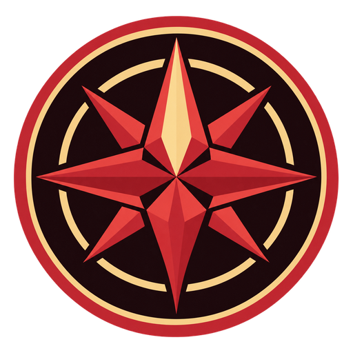

<h1 align="center">Navmut</h1>

<p align="center">

</p>

<p align="center">
Map navigation and NPC/mob position recording for Final Fantasy XIV 1.23b
emulation servers.
</p>

<p align="center">
<a href="LICENSE"></a>
<a href=".github/workflows/ci.yml"></a>
</p>

## About

- Navigate maps for Final Fantasy XIV 1.23b emulation servers.
- Use the bundled map catalog and artwork without external setup.
- Record NPC and mob positions.
- Keep settings, saved points, and journal observations in the portable
  Windows ZIP's `data` folder.

## Controls

| Action | Key |
| --- | --- |
| Move north | Arrow Up |
| Move south | Arrow Down |
| Move west | Arrow Left |
| Move east | Arrow Right |
| Move up | Page Up |
| Move down | Page Down |

Diagonal movement uses the on-screen buttons. Movement keys are ignored while
typing in a text field or using a selector.

## Wine bridge

For live game access from native Linux/macOS Navmut, see the
[Wine bridge setup](docs/bridge.md). The Windows ZIP includes the x86 bridge
and its native helpers.

## Build

Install Node dependencies:

```text
npm ci
```

On Windows, with CMake and the MSVC x86/x64 build tools installed:

```powershell
.\tools\package-windows.ps1
```

On Linux or macOS:

```text
npm run tauri -- build
```

## Acknowledgement

ProjectTako, used as a reference.

## License

<a href="LICENSE"></a>
